# UD6-English-Dictionary

# Manual de usuario

este es el menu

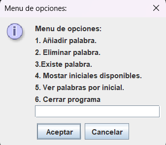

si el usuario selcciona la opcion 1 se le solicitara que ingrese una palabra para añiadirla.

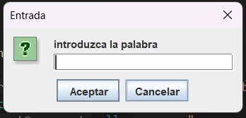

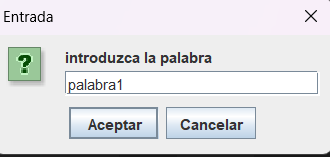

si se ha añidido correctamente se mostrara un mensaje.

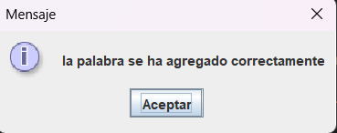

si no introduce nada se mostrara un mensaje de error.

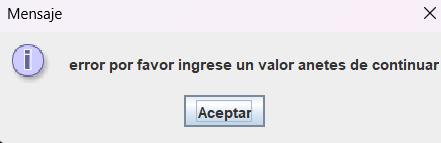

si selecciona la opcion 2 se le solicitara que ingrerse la palabra que desea eliminar.

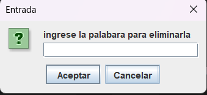

si se encuentra la palabra se mostrara un mensaje de confirmacion que se ha eliminado.

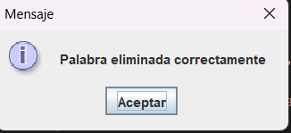

si se introduca un palabra que no se encuntra guardada o que se haya eliminado previamente.

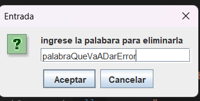

se mostrara un mensaje al usuario.

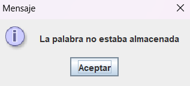

si el usuario selecciona la opcion 3 si le solicitaa que ingrese la palabra que desea saber si existe.

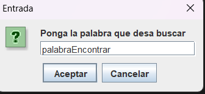

si existe se mostara un mensaje de confirmacion.

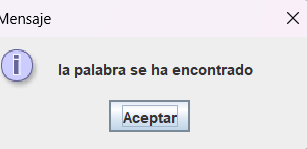

sin no se notificara al usuario que no se ha encontrado la palabra.

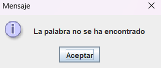

si el usuario selecciona la opcion 4 se le mostraran todas las iniciales disponibles.

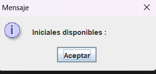

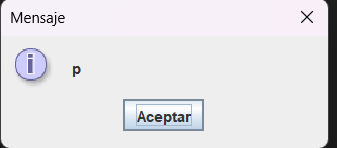

si no hay inicales se le indicara al usario que no hay inicales disponibles.

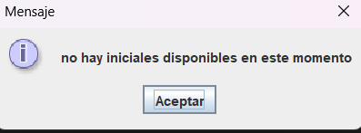

si el usuario seliccona la opcion 5 se solicitara que ingrese una inicial para ver las palabras que empizen por esa inicial.

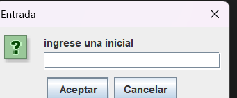

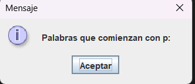

si se encuntran se mostraran las palabras.

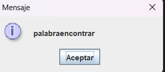

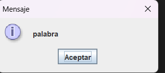

sino se mostrara un mensaje de que no se ha encontrado.

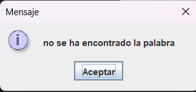

# Documentatcion de clases

En la carpeta net se encuentran las carpetas tools y wordQualifer

- - En la carpeta tools:
- Hay una clase Menu que devuelve un menu

- - En la carpeta wordQualifer
- Hay una clase WordQualifer que tiene todo la solicitado en el enunciado del ejercio
- Esta clase orginiza las palabras basandose en sus iniciales

En App esta el menu con las opcion para que el usuario interactue con el programa
mediante un switch case que tiene las siguientes opciones
- 1 añiadir palabras este metodo añade la palabra y muestra un mensaje de que que añadio correctamente
- 2 eliminar palabra se pedira una palabra y se buscara si la palabra dada coinciode con alguna añiadida y se eliminara
- 3 existe palabra se pedira una palabra y se bsucara si coincide con ulguna guardada si existe se mostrara un mensaje de que ha encontrado sino se encuentra se mostrara un mensaje de que nos eah encontrado
- 4 mostrar inicales disponbles este busca las palabras guardadas y mostrara la iniciales de las palabras
- 5 ver palabras por inicial este pedira una inicial y mediante esta inicial mostrara todas las palabras que empizen por 
ella sino un mensaje de error

foto del propietario de este proyecto y su colaboradora

